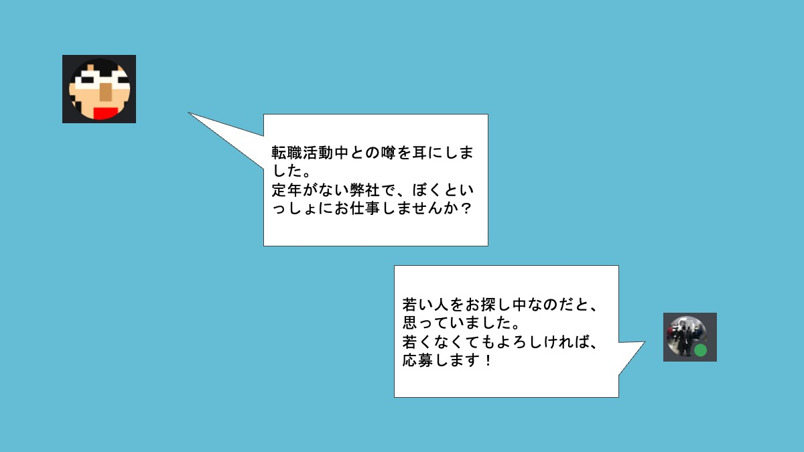
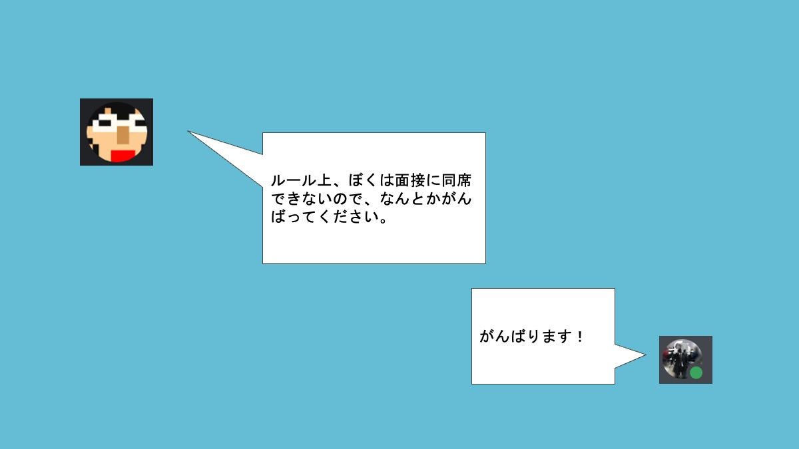

# 引き際は自分で決める！
〜究極の選択と還暦で定年の無い企業に転職した話〜
#### エンジニアがこの先生きのこるためのカンファレンス2025
 11:30〜 Track A　貴島 純子

---
# ハッシュタグ 
全体：#きのこ2025
Track A：#きのこ2025_a

---
<!-- 
header: "わたしは誰？"
-->

# わたしは誰？
#### 貴島 純子（61）
- 所属：サイボウズ株式会社 開発本部 組織支援部 People Experience
  - 前職まで、システム開発（システムエンジニア・プログラマ）
    - 他に職業訓練指導員、QA、経理、営業事務、インストラクタの職歴あり
  - 現在は技術広報っぽい仕事をしています。
  - 転職経験10回（うちフリーランス1年）
- 好き：コーディング、ポケGo、ピクミンブルーム、クラフトビール、特撮、読書、絵を描く、動植物
  - 苦手：雑談
- その他：九州出身、北海道在住、配偶者＋子＋柴犬と暮らしています
---

<!-- 
header: "これから、お話すること"
-->
# これから、お話しすること
## コンセプト
- 誰に：これから定年を迎えるまで10年以上ある方（または、それに近い年齢の方）
- 何と：年齢に関係なく「引き際」という視点で、この先生きのこる方法を考えてみようと思った。
　　　

 と言ってほしい。

---
# これから、お話しすること
- 定年を目前にした転職の動機と転職活動
- 安定とチャレンジの天秤
- 無期転換に向けて
- 定年がないということ
- これからのこと
### お話ししないこと
- 苦労話、武勇伝
---
<!-- 
header: "突然ですが、"
-->
# ご来場の皆さんに、うかがいます
---
# 会社員の方✋️
---
# 定年あり✋️
---
# 嘱託再雇用制度あり✋️
---
# 定年なし✋️
---
<!-- 
header: ""
-->
# ありがとうございます
私は、前職まで、定年がある会社に勤務していました。
60歳の誕生日で定年、その後は1年単位の嘱託再雇用制度（最長5年）がある会社です。
それ以前の転職経験もあり、フリーランスの時期もあるので現職は10社目です。

---
# 定年を目前にした転職の動機と転職活動
---
<!-- 
header: "定年を目前にした転職の動機と転職活動"
-->
# 若い頃は、フリーランスへの憧れがありました
### 自立していて、かっこいい
ある程度スキルを身につけたら、フリーランスで働きたい。

---
# ( ﾟдﾟ)ﾊｯ! フリーランスは、営業力がないといけない！
自分の営業力には、まったく自信がありません。
第1子を授かったのをきっかけに、子どものためにも生活基盤を安定させた方が良いという考えになりました。
以来、会社員として働いてきました。

---
# 定年を目前にしたある日の気づき
## 嘱託再雇用された先輩が、たのしくなさそう。
→結局、先輩は退職してしまいました。

---
# 嘱託再雇用は、転職活動が要らなくて楽？
## 再雇用は、最長5年
65歳は、まだ働ける気がする。働いている方が、健康寿命が伸びそう。
65歳で、転職先を探すの？そっちの方が大変じゃない？💦

---
# ほぼ丸腰の自分のスキルと向き合う
オンプレ環境で社内システム開発＆運用担当では、転職するための武器がない
C#(MVC)＋SQL Serverﾁｮｯﾄﾃﾞｷﾙくらいで何ができるのか...
（他にもいろいろあるけれど、「経験がある」というだけで、正直武器にならなさそう。情報処理安全確保支援士の資格はあるけど、情報セキュリティ担当としての実務経験がない）
## このまま65歳を迎えたとき、自分にどんな選択肢がある？

---
# 派遣社員でもいいから、コードを書き続けたい
## セキュリティにもちょっと興味がある＆資格もあるから、そっちも可能性がある？

---
# 知人の紹介で、某社のセキュリティ部門に応募して玉砕
## セキュリティ部門だけど、日頃は情シスっぽい部門なので、AWSをCLIでバリバリ扱えないと仕事にならない
AWSは触ったことすらなかったので、付け焼き刃でサービスの勉強をしたけど、実技試験で何一つ爪痕を残せませんでした。

---
# じゃあコードを書く部門なら通用するのか？
## 某社の開発者とカジュアル面談して、これは無理だと再認識
SPAって、なにそれおいしいの、クラサバじゃダメなの？
後にReactの勉強を始めるまで、Single Page Applicationがどんなものかわかりませんでした。

---
# 不採用だったけれど、某社への応募をきっかけに、AWSに入門したり、Reactに入門したり、世界が広がりました。
趣味でコードを書くという選択肢もあるという気づき。
転職先の職種の範囲を広げても良いかも？

---
<!--
color: white;
-->
###     ある日、@tomio2480氏からDMが

---
<!--
color: default;
-->
# 若くないけど、いいんですか？
北海道内のIT勉強会に参加していた関係でつながりのある、@tomio2480氏から、リファラル応募のお誘い。
年齢は、問題ではないかもしれない。
私は、「これができます！任せてください！」というものがなく、
「振られれば、やり遂げられる自信はあります」というタイプ。
「決め手に欠ける」私に勝機はあるのか...
ITコミュニティの活動参加や運営経験はあるものの、果たしてそれが役に立つのか...

---
<!--
color: white;
-->
# @tomio2480氏に策を授けていただき、エントリー

 
 
 
 
 
 

---
<!--
color: default;
-->
# なんと、無事に3回の面接をクリア🎉

---
# いただいたオファーは、3ヶ月の有期契約
## 1週間以内に決断しないと、前職の担当業務に影響が💦
詳しくは書けませんが、自分が担当を外れるかどうかの影響範囲が大きかったので、早めの決断が必要でした。

---
<!-- 
header: "安定とチャレンジの天秤"
-->
# 安定とチャレンジの天秤

---
# 3ヶ月後の未来が予測できない不安
- 「更新の可能性あり」「正社員登用の可能性あり」 と言われたものの、可能性の話であって、約束されているわけではない。
- 面接の雰囲気はとても良かったけれど、実際にうまく馴染めるかどうかは別
- 更新されない場合も考慮して、転職活動は継続が必要

---
# 転職しなければ、65歳までの仕事は保証されている
- 転職しなければ、定年まで問題なく勤務できる自信はある。
- 定年後再雇用の打診も受けているので、65歳までは安定した生活が見込める。
---
# 転職しなければ、65歳までの仕事は保証されている
---
# 65歳で、次の転職先を探すのは大変なのでは？
---
# だから今、転職したいのでは？
---
# 3ヶ月の契約期間に、お互いの相性がわかればOK
## 相性を見定めるための3ヶ月
## 相性が悪かったら、次を探せばOK

---
# 3ヶ月の有期雇用のオファー承諾🙇‍♀️
腹を括りました
<!-- ちなみに、月収は現状維持で希望を出していたので、希望どおり。
旧姓の利用もOK -->

---
# 技術広報だけど、コードを書くチャンスがある
＼(^o^)／ヤッター
- CircleCIや、GitHub Actionsなど、前職では経験できなかった技術に触れる機会がある。最高。
- イラストを描いたり、イベントのサポートをしたり、動画を編集したり、その他の担当業務も楽しい。活きるヲタクスキル！転職して良かった！
（個人の感想です）

---
<!-- 
header: "正社員への道"
-->
# 正社員への道

---
# 予想以上に楽しい。ずっと働きたい。
### 契約社員は最長5年で無期雇用への転換ができる
- [無期転換ルールについて（厚生労働省）](https://www.mhlw.go.jp/stf/newpage_21917.html#:~:text=%E5%B9%B3%E6%88%90%2025%20%E5%B9%B4%EF%BC%94%E6%9C%88,%E3%82%8B%E3%83%AB%E3%83%BC%E3%83%AB%E3%81%AE%E3%81%93%E3%81%A8%E3%81%A7%E3%81%99%E3%80%82)
- 社内規定では、
  - 5年を迎える前に無期転換の可能性について確認するタイミングがある。
  - 契約期間中に、正社員エントリーも可能
    - マネージャーに相談後、採用エントリーのフローに従って応募
  
---
## 家人から「いつ正社員になれるの？」とプレッシャーも💦

---
# 2年目に入って、無期転換に向けて始動
## 2年前との違いは、「実績と、今後やりたいこと、が言えそう」なこと
## 一方、年齢をどう判断されるか？が心配

---
# マネージャーの手厚いサポートを受けて準備、そしてエントリー！
　　　マネージャーのお二人には、大感謝！

---
# 2024年2月11日付けで、正社員になりました🎉
＼(^o^)／ヤッター

マネージャーのお二人には、大感謝！（2回目）

---
<!-- 
header: "# 定年がないということ
"
-->
# 定年がないということ

---
# ＝自分で辞め時を判断しなければならない

---
# 私が考える辞め時ポイント
1. 体力的に、業務遂行が難しくなった
1. 客観的にみて、明らかにパフォーマンスが落ちた
1. 会社やチームの方針と合わなくなった

---
# 判断の基準
- 自分で判断するのは、客観性に欠けるのでは？
→定期的にマネージャと1on1の機会があるので、そこでチェックできそう

---
# 引き際は自分で決める！
 
---
# ~~引き際は自分で決める！~~

---
# 引き際は周囲と相談して決める！
酔っ払いは「酔ってません」って言うし、年寄は「まだまだ耄碌しとらん！」って言うから、アテにならない。
客観的に「求められている価値が提供できていない」と判断されたときが、辞め時と思っています。
とか言いながら、単純に、居心地が悪くなったら辞めるのかもしれません。

---
<!-- 
header: "# これからのこと
"
-->
# これからのこと

---
# こんな景色を見せてくれたサイボウズの飛び道具@tomio2480さんが今月退職
あのときお声がけいただけなかったら、今の私はありません。
本当にありがとうございました！

---
# @tomio2480さんの今後に、ご期待ください。
### TechRAMEN Conference 2025がUpを始めているので、そちらもお楽しみに

---
# 自分は、@tomio2480さんのような破壊力がない、普通の人なので

---

---
# @tomio2480さんにいただいた「ブログ魔人」の名に恥じないよう、こちらも引き続き精進します💪
👇️毎週記事を公開中
https://note.com/_tetrapod/

---
<!-- 
header: ""
footer: ""
-->
# ありがとうございました！

## 来場者アンケートは、 こちらから！
https://fortee.jp/kinoko-2025/go/feedback 

