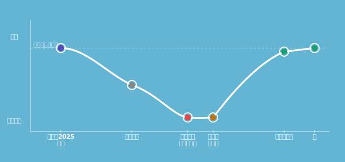

# 引き際は、明るい方がいい
〜きのこ2025のその後のご報告〜
#### エンジニアがこの先生きのこるためのカンファレンス2026
 15:00 〜 Track A　貴島 純子

---
# ハッシュタグ 
全体：#きのこ2026
Track A：#きのこセッション_a

---
# わたしは誰？

#### 貴島 純子（63）　←「特別支給の老齢厚生年金」受給対象
- 所属：サイボウズ株式会社
開発本部 開発支援副本部 組織支援部 (開発) Tech Media Platformチーム
  - 前職まで、システム開発（システムエンジニア・プログラマ）
    - <small>他に職業訓練指導員、QA、経理、営業事務、インストラクタの職歴あり</small>
  - 現在は技術広報っぽい仕事をしています。
  - 転職経験10回（うちフリーランス1年）

---
# 今日お話する流れ

---
# きのこ2025のあらすじ
- 定年がないので、「引き際は、周囲と相談して決める！」と結論づけました。

---
<!-- _backgroundImage: url('./images/graph_bg_01_登壇.svg') -->
<!-- _backgroundSize: 45% -->
<!-- _backgroundPosition: right bottom -->
# きのこ2025登壇当時
- 新しいこと、興味があることに取り組むのが楽しい
- 「引き際」は、余裕を持ってマネージャーと相談できれば良いと思っていた。

---
<!-- _backgroundImage: url('./images/graph_bg_01_登壇.svg') -->
<!-- _backgroundSize: 45% -->
<!-- _backgroundPosition: right bottom -->

# できることを増やしてきた

- 難しい依頼ほど、解決策を考えるのが好き
- 「自分がカバーできれば」という気持ちで動いてきた
- きのこ2025登壇のころは、それがうまく機能していた

---
<!-- 背景: graph_bg_02_組織変化.svg -->
<!-- _backgroundImage: url('./images/graph_bg_02_組織変化.svg') -->
<!-- _backgroundSize: 45% -->
<!-- _backgroundPosition: right bottom -->
# チームの「理想」が変わった

- チームが目指す「理想」が変わった
- チームの「理想」が変わり、「やるべきこと」も変わった
- 「やりたいこと」「できること」と、「やるべきこと」がマッチしなくなった
  - できることを増やしても、チームに貢献できない

---
<!-- _backgroundImage: url('./images/graph_bg_03_底.svg') -->
<!-- _backgroundSize: 45% -->
<!-- _backgroundPosition: right bottom -->

# 新しい「やるべきこと」が見つけられない

- 今まで、組織の変化に合わせて、「やるべきこと」と「やりたいこと」をマッチさせてきた
  - 今回は、新しい「やるべきこと」とマッチさせることができない
  - モチベーションが低下していった
  - 「自分はここにいていいのか」という気持ちが芽生えた
  - 「引き際」なのかも？

---
<!-- 背景: graph_bg_04_本.svg -->
<!-- _backgroundImage: url('./images/graph_bg_04_本.svg') -->
<!-- _backgroundSize: 45% -->
<!-- _backgroundPosition: right bottom -->

# 1冊の本との出会い

ドリューさんの「When No One's Keeping Score」

- 自分の成果・成長のことばかり考えていた
- 「コミュニティへの貢献」に意識が向いた
- 視野が広がった

---
<!-- 背景: graph_bg_04_本.svg -->
<!-- _backgroundImage: url('./images/graph_bg_04_本.svg') -->
<!-- _backgroundSize: 45% -->
<!-- _backgroundPosition: right bottom -->
# そういえば、絵を描くのが好きだった

- 無心になれる時間が、自分を取り戻させてくれた
- 行動が変化した
- 本来の自分が、少しずつ戻ってきた

---
<!-- 背景: graph_bg_05_チーム移動.svg -->
<!-- _backgroundImage: url('./images/graph_bg_05_チーム移動.svg') -->
<!-- _backgroundSize: 45% -->
<!-- _backgroundPosition: right bottom -->
# 環境も、動いた

- マネージャーの配慮で、チーム編成が見直された
- 担当が絞られたことで、探求する時間が生まれた
- OSPOに参加、「知らないことは聞けばいい」空気に救われた
  - 新しいチャレンジが成果につながる楽しさ
---
<!-- _backgroundImage: url('./images/graph_bg_06_今.svg') -->
<!-- _backgroundSize: 45% -->
<!-- _backgroundPosition: right bottom -->

# 元気＝モチベーションかも
- 「やりたいこと」、「できること」、「やるべきこと」のバランスが重要
- 自分の行動が価値を生み出し、チームに貢献できる状態が理想
- 仕事に対する理想がわかった
- では、どんな引き際が理想なのか？

---
<!-- _backgroundImage: url('./images/graph_bg_06_今.svg') -->
<!-- _backgroundSize: 45% -->
<!-- _backgroundPosition: right bottom -->

# 今回、引き際と判断しなかった理由

- 自分の内側が整っていない状態が続いていた
  - 辛い状態から逃げるのも悪くないが、その先が見えないのは不安しかない
  - 逃げるなら、未来に向かいたい（受けるなら、向こう傷！）
  

---
<!-- _backgroundImage: url('./images/graph_bg_06_今.svg') -->
<!-- _backgroundSize: 45% -->
<!-- _backgroundPosition: right bottom -->

# 改めて考えた、「理想の引き際」

- 自分の内側が整っているときに、判断したい
  - 自分の内側が整っていない状態の判断は、信用できない
  - 自分に対しても説得力がほしい
- 下を向くのではなく、未来に向かいたい

---
# まとめると

- 去年は気軽に考えていた「引き際」に直面した
- 自分の内側が整っていないと、重い判断は難しい
- 私にとって、明るい引き際は「未来」に向かうための進路変更
- 当たり前だけど、自分の未来を考えておくことが引き際の判断材料になる
---

# ありがとうございました
---
<!-- _backgroundImage: url('./images/A4_TechRAMEN-2026-Conference_kokuchi_FIX.jpg') -->
<!-- _backgroundSize: 40% -->
<!-- _backgroundPosition: right top -->
# 【おまけ】
# ことしも Tech RAMEN Conference やります
2026/11/20-21 富良野で待ってます！

---

