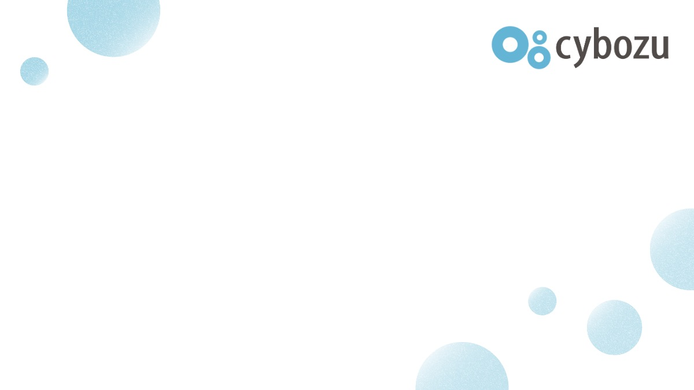
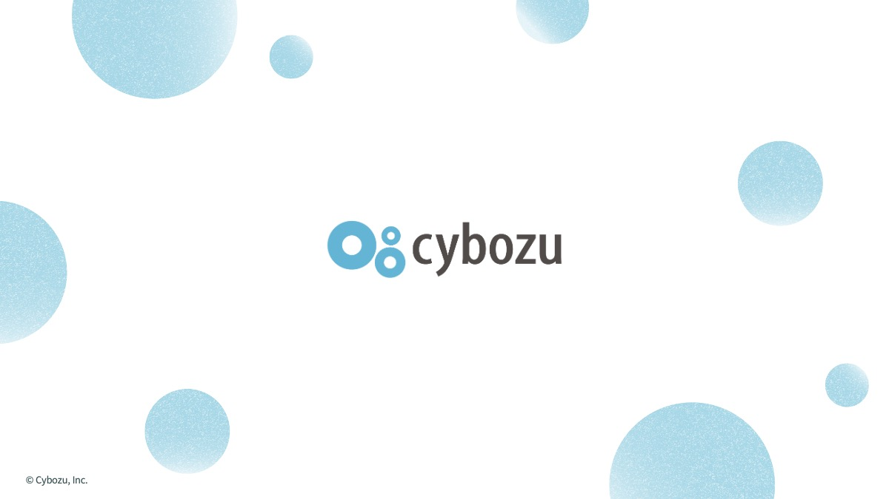

# 引き際は、明るい方がいい
〜きのこ2025のその後のご報告〜
#### エンジニアがこの先生きのこるためのカンファレンス2026
 15:00 〜 Track A　貴島 純子

---
# ハッシュタグ 
全体：#きのこ2026
Track A：#きのこセッション_a

---
# わたしは誰？

#### 貴島 純子（63）　←「特別支給の老齢厚生年金」受給対象
- 所属：サイボウズ株式会社
開発本部 開発支援副本部 組織支援部 (開発) Tech Media Platformチーム
  - 前職まで、システム開発（システムエンジニア・プログラマ）
    - <small>他に職業訓練指導員、QA、経理、営業事務、インストラクタの職歴あり</small>
  - 現在は技術広報っぽい仕事をしています。
  - 転職経験10回（うちフリーランス1年）

---
# 今日お話する流れ

---
# きのこ2025のあらすじ
- 定年がないので、「引き際は、周囲と相談して決める！」と結論づけました。

---
<!-- _backgroundImage: url('../images/graph_bg_01_登壇.svg') -->
<!-- _backgroundSize: 45% -->
<!-- _backgroundPosition: right bottom -->
# きのこ2025登壇当時
- 新しいこと、興味があることに取り組むのが楽しい
- 「引き際」は、余裕を持ってマネージャーと相談できれば良いと思っていた。

---
<!-- _backgroundImage: url('../images/graph_bg_01_登壇.svg') -->
<!-- _backgroundSize: 45% -->
<!-- _backgroundPosition: right bottom -->

# できることを増やしてきた

- 難しい依頼ほど、解決策を考えるのが好き
- 「自分がカバーできれば」という気持ちで動いてきた
- きのこ2025登壇のころは、それがうまく機能していた

---
<!-- 背景: graph_bg_02_組織変化.svg -->
<!-- _backgroundImage: url('../images/graph_bg_02_組織変化.svg') -->
<!-- _backgroundSize: 45% -->
<!-- _backgroundPosition: right bottom -->
# チームのバランスが変わった

- 同じように動けるメンバーが少なくなった
- チームの「標準」が変わっていった
- 自分はいつの間にか、**ハズレ値**になっていた

---
<!-- _backgroundImage: url('../images/graph_bg_03_底.svg') -->
<!-- _backgroundSize: 45% -->
<!-- _backgroundPosition: right bottom -->

# 「できる」が「やってはいけない」に変わっていった

- チャレンジして取り組んだことが、チームの提供価値を下げているかもしれない
- 「自分はここにいていいのか」という気持ちが芽生えた

---
<!-- 背景: graph_bg_04_本.svg -->
<!-- _backgroundImage: url('../images/graph_bg_04_本.svg') -->
<!-- _backgroundSize: 45% -->
<!-- _backgroundPosition: right bottom -->

# 1冊の本との出会い

ドリューさんの「When No One's Keeping Score」

- 自分の成果・成長のことばかり考えていた
- 「コミュニティへの貢献」に意識が向いた
- 視野が広がった

---
<!-- 背景: graph_bg_04_本.svg -->
<!-- _backgroundImage: url('../images/graph_bg_04_本.svg') -->
<!-- _backgroundSize: 45% -->
<!-- _backgroundPosition: right bottom -->
# そういえば、絵を描くのが好きだった

- 無心になれる時間が、自分を取り戻してくれた
- 「成果」を求めない時間の大切さに気づいた
- 本来の自分が、少しずつ戻ってきた

---
<!-- 背景: graph_bg_05_チーム移動.svg -->
<!-- _backgroundImage: url('../images/graph_bg_05_チーム移動.svg') -->
<!-- _backgroundSize: 45% -->
<!-- _backgroundPosition: right bottom -->
# 環境も、動いた

- マネージャーの配慮で、チーム編成が見直された
- 担当が絞られたことで、探求する時間が生まれた
- OSPOの活動で「知らないことは聞けばいい」空気に救われた
---
<!-- _backgroundImage: url('../images/graph_bg_06_今.svg') -->
<!-- _backgroundSize: 45% -->
<!-- _backgroundPosition: right bottom -->

# 今回、引き際と判断しなかった理由

- 退職すれば、モヤモヤを手放せると思った
- でも、退職してもモヤモヤは残りそうだった
- 「逃げ」の選択は、したくなかった

---
<!-- _backgroundImage: url('../images/graph_bg_06_今.svg') -->
<!-- _backgroundSize: 45% -->
<!-- _backgroundPosition: right bottom -->

# 改めて考えた、「理想の引き際」

- 「逃げ」ではなく、「次へ」と言える状態で選ぶこと
- 自分の内側が整っているときに、判断すること
- **引き際は、明るい方がいい**

---
# ことしもTech RAMEN Conferenceやります
富良野で待ってます！

---
# まとめると

- しんどいときこそ、自分の内側に戻る時間を
- 「逃げ」か「次へ」か、整った状態で判断する
- 引き際は、明るい方がいい

---
# ありがとうございました

---

